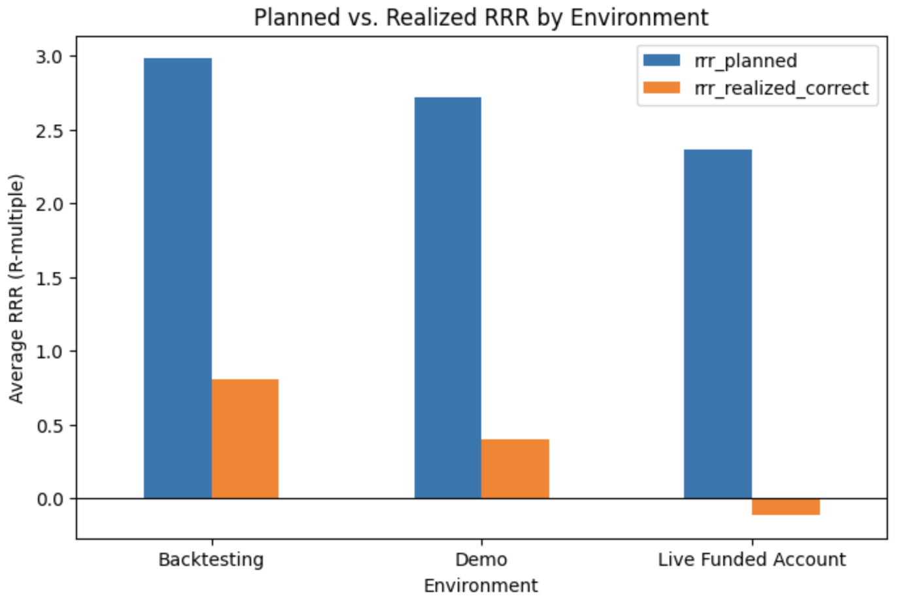
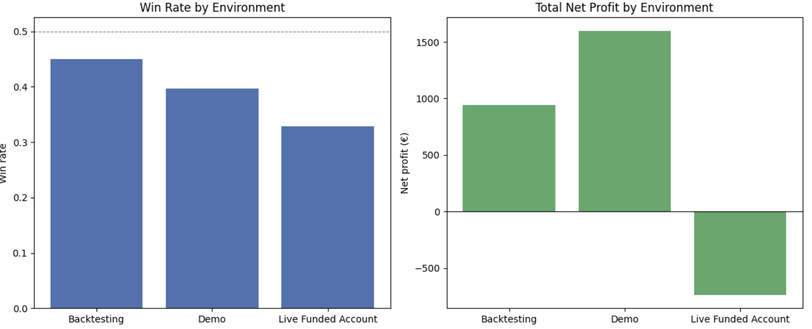
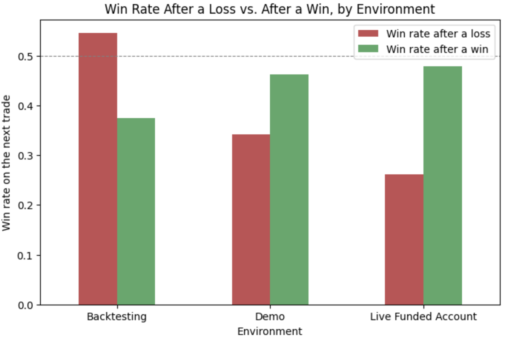

# Trading Study Analysis (2023–2024)

## Problem Statement

This project analyzes my personal trading activity during my early trading study period, covering trades recorded between 2023 and 2024, before I shifted focus to Data Analytics.

The goal is to investigate execution quality and decision-making during this beginning phase, focusing on the gap between planned and actual outcomes rather than overall profitability — and to apply a real data cleaning and analysis workflow to a messy, real-world dataset.

**Key questions:**
- How does my realized Risk-Reward Ratio (RRR) compare to the RRR I originally planned for each trade?
- How does performance vary across different account/environment types (backtesting, demo, and live funded accounts)?
- Is there a measurable change in performance immediately following a losing trade (post-loss sequence)?

---

## Data 

The dataset contains manually recorded trading data collected between January 2023 and August 2024, originally spread across two separate Excel files (one per year) and merged into a single dataset for this analysis.

Key characteristics and data quality notes:

- This was my first structured trading journal. The raw data contained manual entry inconsistencies: inconsistent capitalization (W/w, Long/long), typos in date fields (e.g. "Mario" instead of "Março", a double space in one date), and a mix of account/environment categories.
- 7 trades had no W/L result recorded. These were inferred from the sign of the net profit (positive → W, negative → L) rather than dropped, since the financial outcome was available even though the label was missing.
- The `RRR Realized` field in the original spreadsheet was on a different scale than `RRR Planned` and not directly comparable. The correct realized RRR was recalculated as `net profit / risk in euros`, confirmed against trades that closed exactly at take-profit.
- Data covers 2023–2024 only. No 2022 or 2025 records were available for this project.
- Account/environment types were grouped into three categories — **Backtesting**, **Demo**, and **Live Funded Account** — to avoid mixing risk-free simulation with real capital when comparing performance.

---

## Data Cleaning & Transformation
- Translated column headers from Portuguese to English
- Rounded monetary values to cents (account funds, risk, profit, net profit)
- Grouped 9 raw account/environment labels into 3 consistent categories: Backtesting, Demo, and Live Funded Account
- Standardized inconsistent capitalization across categorical fields (trade result, direction, product names)
- Fixed spelling typos in date fields and converted entry dates from  written Portuguese text into proper date values
- Filled missing product subgroup values by classifying products individually (e.g. GBPUSD/EURUSD as Majors, remaining pairs as Minors)
- Recalculated realized RRR (net profit / risk in euros), after confirming the original spreadsheet column was on a different, non-comparable scale to planned RRR
- Inferred 7 missing trade results (W/L) from the sign of the net profit, since the financial outcome was available even though the label was missing

---

## Phase 1 – Planned vs. Realized RRR

  

**Key Insights:**
- Planned RRR ranged from 2.4 to 3.0 across all environments — the trading strategy itself has a reasonable theoretical edge on paper.
- Realized RRR fell far short of the plan in every environment, and turned negative (-0.12) in the Live Funded Account.
- The gap between planned and realized performance grows as the environment becomes more real: smallest in Backtesting, largest in the Live Funded Account.

---

## Phase 2 – Performance by Environment

  

**Key Insights:**
- The Live Funded Account is the weakest environment overall: the lowest win rate (32.9%), the lowest realized RRR, and the only environment with a net loss (-737€), despite having the largest number of trades (70).
- Average risk per trade increased substantially across environments (58€ in Backtesting vs. 96€ in the Live Funded Account) — absolute profit comparisons across environments should be read with this in mind, since larger position sizes produce larger euro swings regardless of skill.

---

## Phase 3 – Post-Loss Sequence

  

**Key Insights:**
- Win rate drops noticeably after a loss in Demo and Live Funded Account (e.g. 47.8% → 26.1% in the live account) — a possible sign of reduced discipline following a loss.
- Backtesting shows the opposite pattern, consistent with the absence of real money or emotional pressure in that environment.
- With 158 trades total, this should be treated as a hypothesis to monitor, not a proven pattern.

---

### Interactive Dashboard

---

## Tools & Technologies

- Python (Pandas, Matplotlib)
- Jupyter Notebook (Google Colab)
- Tableau Public
- Excel

---

## Conclusions

- The planned RRR (2.4–3.0) suggests the strategy itself has a reasonable theoretical edge, but execution consistently fails to deliver it.
- The gap between planned and realized performance grows as the environment becomes more real — smallest in Backtesting, largest in the Live Funded Account.
- The main problem isn't strategy selection, it's discipline in execution — sticking to planned take-profit and stop-loss levels rather than exiting early.
- The post-loss win rate drop (Demo and Live Funded Account) is a discipline signal worth monitoring, not a proven pattern — the sample size is too small to be conclusive.

---

## Limitations

- Small sample size (158 trades total, some environments with as few as 20).
- Data covers 2023–2024 only. No records for 2022 or 2025 were available for this project.
- This was my first structured trading journal, so the raw data contained manual entry inconsistencies.
- The analysis identifies *that* execution falls short of the plan, but not *why*.

---

## Next Steps

- Investigate whether early exits avoided larger losses or gave up real gains, by cross-referencing trade exits with historical market price data.
- Expand the dataset with 2022 and 2025 records, if they become available.

---

## Author

Gabriela Rijo
Aspiring Data Analyst
Based in Ireland
